# 优酷路由宝 OpenWrt 刷机 科学上网

## 资源列表
- 优酷土豆路由宝已获取 root 权限的版本固件。
    下载:https://biaowong.lanzouu.com/iChJt031yeud 密码:e6ot
- Breed 刷机工具。
    下载:https://biaowong.lanzouu.com/iT2KU031yh2d 密码:3n8b
- 小碗儿数码 / Powered by LuCI Master (git-21.197.21199-cd0ddb8) / ArgonTheme v1.7.2 / OpenWrt R21.7.15 固件。
    下载:https://biaowong.lanzouu.com/iWXY8031yi1i 密码:cfho
- SCP文件上传工具WinSCP。
    下载:https://biaowong.lanzouu.com/ifxsd03214of 密码:7frs
- SSH连接工具putty。
    下载:https://biaowong.lanzouu.com/i8wZv0320omh 密码:cm0c

*注：所有 `.zip` 文件都需要解压后使用。*

## 步骤一、降级固件版本并获取路由器 Root 权限
登录路由器管理后台，「更多设置」->「系统升级」->「手动升级」，选择前面下载的 `Youku-L1c-0818-root.bin`，并点击「上传文件」，等待升级包验证通过，点击「立即升级」，待等升级成功后路由器会自动重启，这个过程中不要断开网线也不要断开电源。
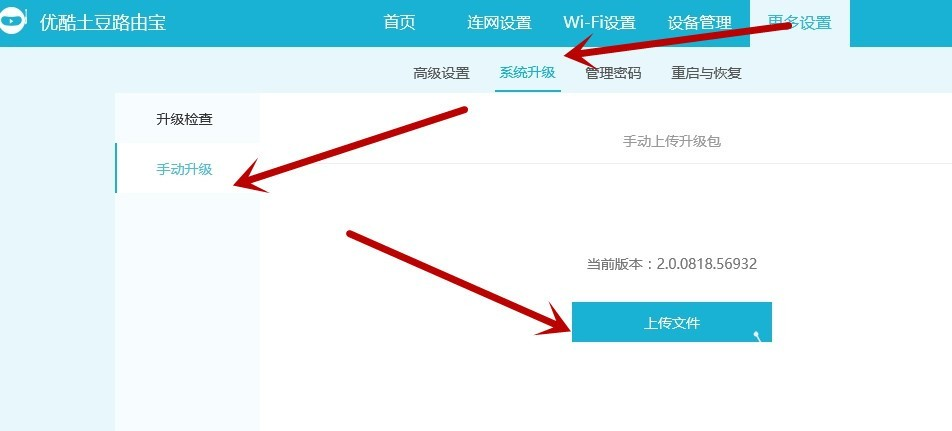

## 步骤二、路由器刷 Breed Web 恢复控制台
刷完步骤一后，把路由断电后按住 Reset 键后通电，Led 灯全闪后等 2 秒松开 Reset 键。至此固件已经获取到 Root 权限。用户名：`root` 密码：`admin`

运行 WinSCP.exe，如下图所示，

文件协议：`SCP` 输入主机名：`192.168.1.1` 用户名：`root` 密码：`admin` 点击「登录」。

将文件 `breed-mt7620-youku-yk1` 上传到 `tmp` 目录中。
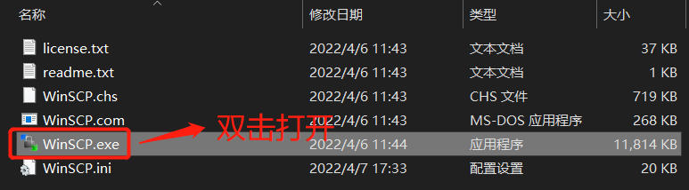
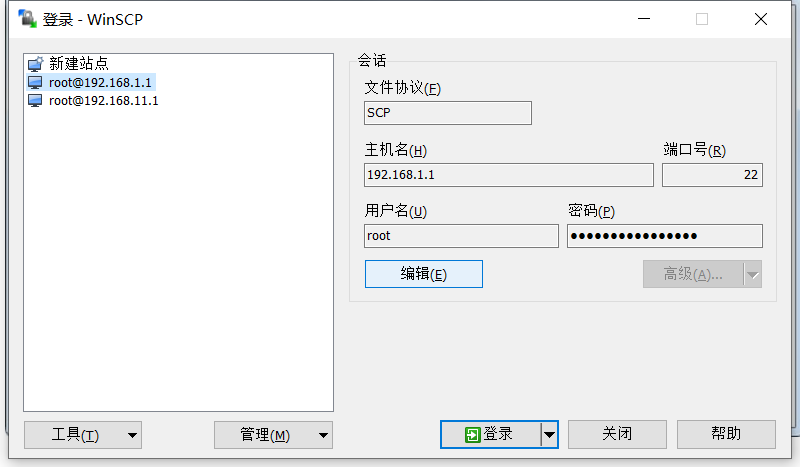
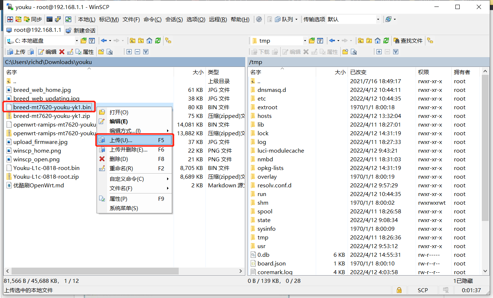

打开 putty_V0.63.0.0.43510830.exe，输入 Host Name：`192.168.1.1` Port：`22` Connection Type：`SSH`， 点击「Open」。进入命令终端后，按照提示输入用户名：`root` 回车，密码：`admin` 回车（密码输入时不显示）。系统登录成功后执执行以下命令刷入 Breed 固件：
```
mtd write /tmp/breed-mt7620-youku-yk1.bin mtd1
```
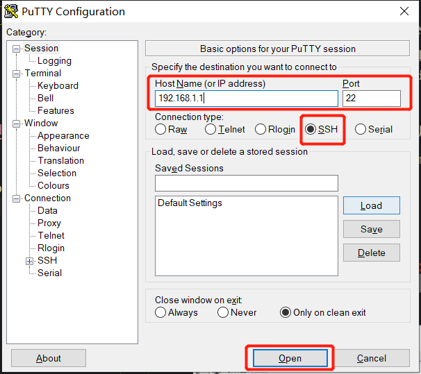
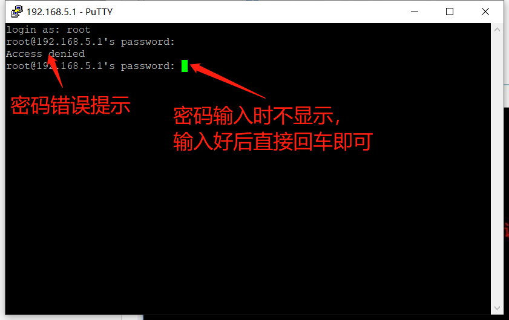
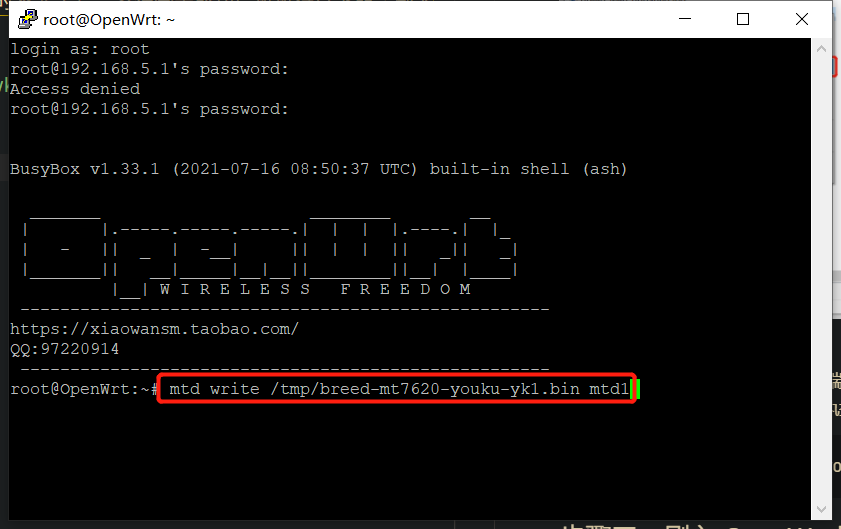

## 步骤三、刷入 OpenWrt 固件

刷完步骤二后，把路由断电后按住 Reset 键后通电，Led 灯全闪后等 2 秒松开 Reset 键。打开浏览器，输入：`192.168.1.1` 访问 Breed Web 恢复控制后台。点击「固件更新」->「固件-选择文件」弹出文件选择框，选中 `openwrt-ramips-mt7620-youku_yk-l1-squashfs-sysupgrade.bin` 确认并点击	按钮。进入固件确认页，点击「更新」，等待进度条读完即可。

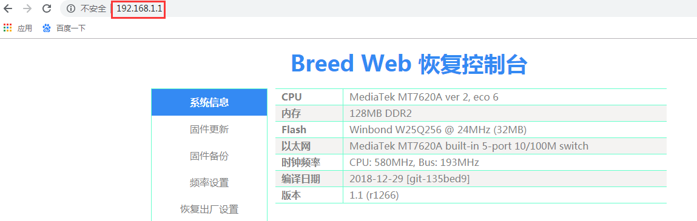

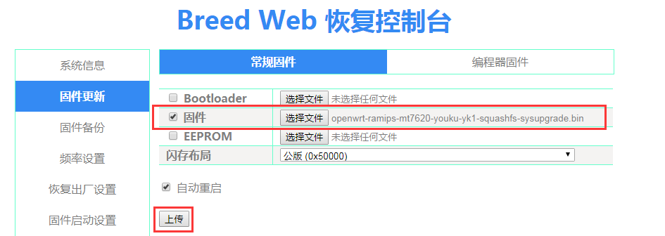

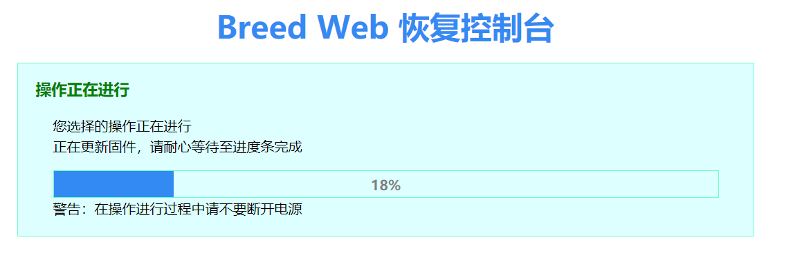

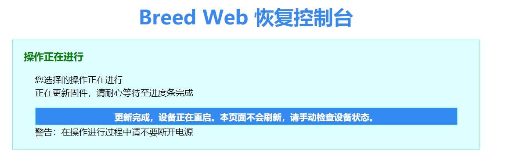

## 步骤四、科学上网

